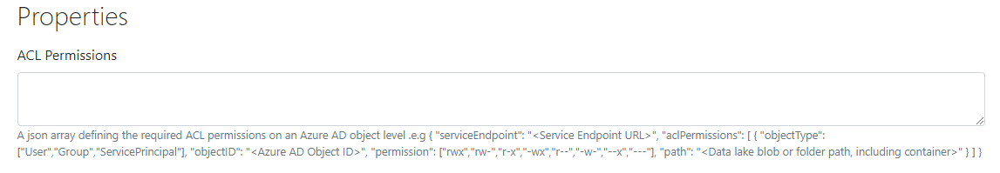
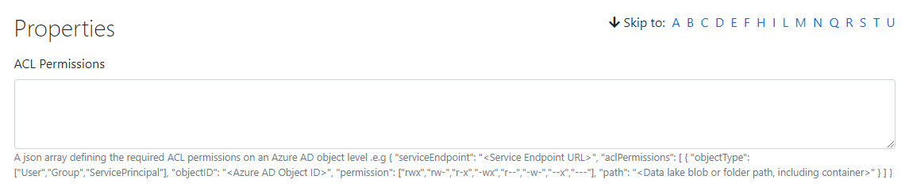
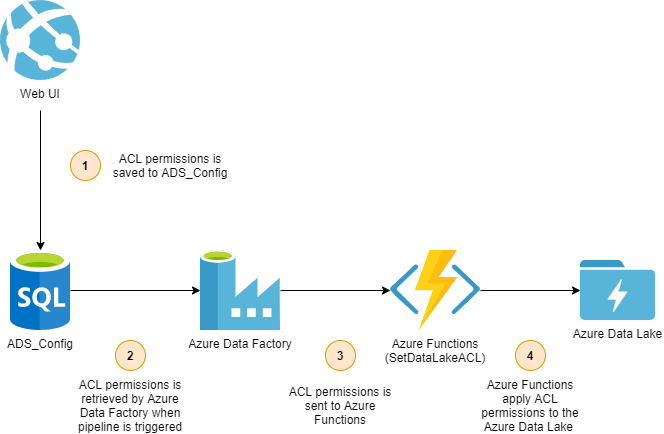

# Introduction 

To properly govern access to data in the Azure Data Lake, Access Control Lists (ACLs) need to be applied. 

To understand the fundamentals of what ACLs are, please see [Microsoft Docs](https://docs.microsoft.com/en-us/azure/storage/blobs/data-lake-storage-access-control) for details. The rest of this documentation assumes that the reader has the fundamental understanding of ACLs from the aforementioned Microsoft docs. 

# Applying ACLs

To apply ACLs, the user has two options of where they would like to configure ACLs: 
1. The System level - sets ACLs for all tasks within a system. 
2. The Task level - sets ACLs for only the selected task. 

## System level 

To configure ACLs at a system level, perform the steps below: 

1. Select "Edit" on an existing system 
2. Populate "ACL Permissions" with the ACL object (see [ACL Object](#acl-object) for details on how to configure the ACL object). 




## Task level 

1. Select "Edit" on an existing task 
2. Populate "ACL Permissions" with the ACL object (see [ACL Object](#acl-object) for details on how to configure the ACL object). 




## ACL object 

The ACL object takes on the following structure: 

```json
{
    "serviceEndpoint": "<Service Endpoint URL>",
    "aclPermissions": 
        [
            {
            "objectType": ["User","Group","ServicePrincipal"],
            "objectID": "<Azure AD Object ID>",
            "permission": ["rwx","rw-","r-x","-wx","r--","-w-","--x","---"],
            "path": "<Data lake blob or folder path, including container>"
            }
        ]
}
```

For example: 

```json
{
    "serviceEndpoint" : "https://yourendpoint.blob.core.windows.net", 
    "aclPermissions": [
        {
        "objectType": "User",
        "objectId": "1234567890",
        "permission": "r-x",
        "path": "datalakestore/delta/finance/dbo/accounts"
        }
    ]
}
```

# How is the ACLs applied?

