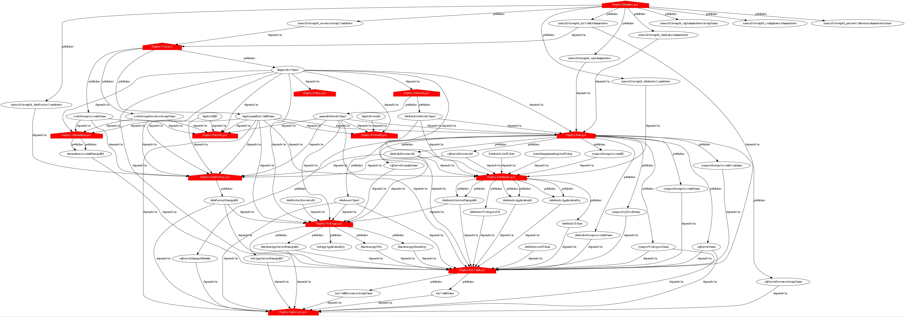
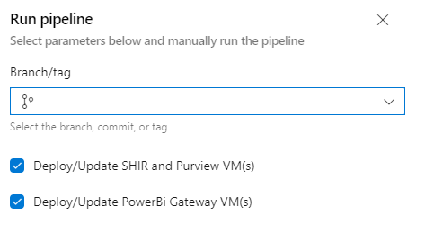

# CI/CD Pipeline

[[_TOC_]]

## Continuous Integration

The Continuous Integration is at `azure-pipelines.yml`.

The CI part of the pipeline is much simpler than a traditional application build pipeline as there is nothing to compile. It consists of a single step that zips up the repository and publishes it as an Azure DevOps build artifact.

The build pipeline is triggered automatically on commit to `origin/Main`.

There is a branch policy on `origin/Main` to forbid direct commits. Please create a branch from `origin/Main` to make changes and complete Pull Requests instead. See [https://www.azuredevopslabs.com/labs/azuredevops/pullrequests/](https://www.azuredevopslabs.com/labs/azuredevops/pullrequests/).

# Continuous Delivery

**Deployment**

Deploys are orchestrated by Azure DevOps as part of the `azure-pipelines.yml` file.

Deployments occur by running the relevant PowerShell scripts and passing in the correct information. This is orchestrated for Azure DevOps via `azure-pipelines.yml`.

e.g. `> Deploy-Core.ps1 -EnvironmentName "Development" -EnvironmentCode "DEV" -Location "australiaeast" -LocationCode "SYD" -TenantId "<tenant id guid>" -SubscriptionId "<subscription id guid>" -ConfigFile "config.dev.json"`

The general dependency structure of this infrastructure automation is:

> \[`Deploy-*.ps1`\] -> \[`arm/{template}.json`\] -> \[`Outputs`\] -> \[`Deploy-*.ps1`\] -> ...

The various `Deploy-*.ps1` scripts orchestrate:

- Resource names (consistent according to a specified naming convention)
- Passed in parameters
- Config JSON values
- Locally specified values
- Writing log messages so it's clear what's happening
- Breakpoint debugging

Each script has the following "core parameters" will always be passed in (per above example):

- `EnvironmentName`: The long name of the environment being deployed e.g. `Development`
- `EnvironmentCode`: The short environment name code being deployed e.g. `DEV`
- `Location`: The Azure region being deployed into e.g. `australiaeast`
- `LocationCode`: The short code of the location being deployed to e.g. `SYD`
- `TenantId`: The Azure AD tenant ID of the Azure subscription being deployed to
- `SubscriptionId`: The ID of the Azure AD subscription being deployed to

Each script expects the `Az` PowerShell module to be installed and a suitably authorised principal loaded in context (e.g. via `Connect-AzAccount`).

There are a number of scripts available that each executes different parts of the whole solution and some of them publish variables that then need to be passed into subsequent scripts. The scripts, suggested order, and variables they publish and consume are as follows:

1. `Deploy-Identities.ps1`: Creates and Finds the Azure AD Groups for the platform

1. `Deploy-Core.ps1`: Creates resource groups and deploys Log Analytics, Diagnostics Storage, Microsoft Insights (Audit Log), Code Storage and Deployment Key Vault

1. `Deploy-Policy.ps1`: Creates Azure Security Centre and Azure Policy (basic and ISM Australia Protected)

1. `Deploy-Network.ps1`: Creates DDoS Plan, Network Watcher, Network Security Groups, Virtual Networks, Peerings and associated Subnets

1. `Deploy-Automation.ps1`: Uploads automation runbook PowerShell scripts (`code/runbooks/*.ps1`) to the `runbooks` container in the code storage account and creates Automation Account

1. `Deploy-Data.ps1`: Creates Data Lake, Data Factory, SQL Server, Synapse, Config DB and Stage DB

1. `Deploy-Purview.ps1`: Creates Purview and integration virtual machines

1. `Deploy-PowerBI.ps1`: Creates PowerBI gateway integration virtual machines

1. `Deploy-Databricks.ps1`: Creates Databricks and configures it

1. `Deploy-DataFactory.ps1`: Creates DataFactoy, uploads a Powershell script (`code/scripts/Install-SelfHostedIR.ps1`) to the `code` container in the code storage account and create the Self-Hosted Integration Runtime Virtual Machines.

1. `Deploy-WebApp.ps1`: Creates AppInsights, Web App and Function App.

1. `Deploy-KeyVault.ps1`: Creates KeyVault and deploys a number of secrets.

1. `Deploy-SqlAccess.ps1`: Creates various SQL user accounts and sets appropriate permissions for them against the Config DB and Stage DB.

## Publishes and Depends On

Each PowerShell script works in a way where the output of one is used as the input for others. This is done by using input parameters or publishing of variables. There is a handy PowerShell script `Set-Documentation.ps1` that you can run to see these publishes and depends on.

## Support for skipping Virtual Machine Deployments

Deploying Azure Virtual machines can, even at the best of times, but a slow process. This is because the particular order in which various extensions and scripts are run post VM deployment and startup and how the Resource Manager agent must wait for a response.

Even though all `virtualMachine.*.json` ARM templates in this repository are idempotent, the slowness of the deploy can be tedious. To support deploying other infrastructure code changes without having to wait for the VM(s), at pipeline run, you can uncheck the option to deploy Azure Data Factory and Purview, and/or the PowerBi gateway virtual machines.

These toggles/ checkboxes assume of course if you are deploying the virtual machines. What does this mean? Well if in the `config.*.json` file you have specified _not_ (set to `$false`) to deploy the particular virtual machines, this option will have no effect selected or not.
