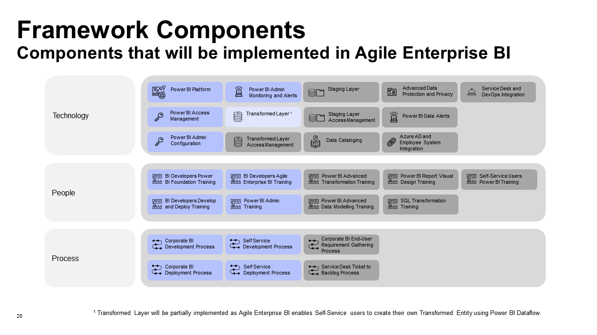
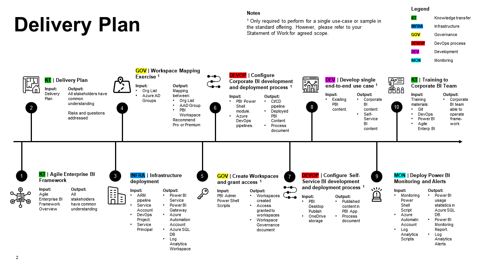
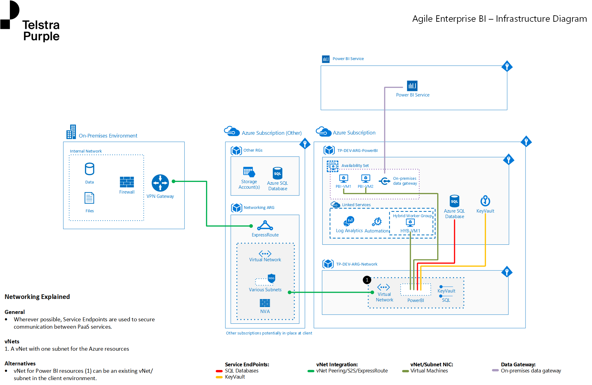

# Delivery Guide
This guide aims to documents the steps a Telstra Purple consultant should perform in order to implement Agile Enterprise BI. 

To grasp an understanding of what is Agile Enterprise BI, please read [agile-enterprise-bi-framework.pptx](agile-enterprise-bi-framework.pptx). 

## What's Delivered - Framework Components

- The components that are highlighted in **Dark Blue** are components that will be delivered as part of this offering. 
- The components that are highlighted in **Light Blue** are components that will be partially delivered as part of this offering. 
- The components that are highlighted in **Grey** are components that will not be delivered as part of this offering. These components can form add-on components that we can deliver for the client either during the same delivery, or a separate delivery after the standard offering is delivered. 

The Agile Enterprise BI core framework must implement at least the **Blue and Light Blue** components above. Otherwise the framework will be incomplete and have holes which could result in severe negative implications to the client. For example, if all components except Monitoring and Alerting are implemented, then the client self-service users could be sharing sensitive content via "My Workspace" and the Corporate BI team will **not** be notified. 

## How we are delivering - Delivery Plan
The diagram below outlines the key steps during the delivery process. 

## Delivery Timeline
| Step | Component | Day | Running Total of Days | People Requirements | Notes |
|---|---|---|---|---|---|
|01| [Run through the Agile Enterprise BI Framework with Customer](#01-agile-enterprise-bi-framework) | Day 1 | 1 | LC, SC | - | 
|02| [Run through Delivery Plan with Customer](#02-delivery-plan) | Day 1 | 1 | LC, SC | - |
|03| [Deploy infrastructure](#03-infrastructure-deployment)| Day 2 to 3 | 3 | SC | Please ensure that all pre-requsites are provisioned before you carry out this step. You may face some difficulty here with pre-requisites not provisioned correctly. Thus 2 days is allocated for this step as contingency. |
|04| [Conduct Power BI Workspace Mapping Exercise](#04-power-bi-workspace-mapping-exercise) | Day 4 | 4 | LC, SC | Only required to perform for a single use-case in the standard offering. However, please refer to your Statement of Work to determine your scope. |
|05| [Create Power BI Workspace and Grant Access](#05-create-power-bi-workspace-and-grant-access) | Day 5 | 5 | SC | Only required to perform for a single use-case in the standard offering. However, please refer to your Statement of Work to determine your scope. |
|06| [Configure Corporate BI Development and Deployment Process](#06-configure-corporate-bi-development-and-deployment-process)| Day 5 | 5 | SC | - |
|07| [Configure Self-Service BI Development and Deployment Process](#07-configure-self-service-bi-development-and-deployment-process) | Day 5 | 5 | SC | You will need to request access to the use-case SharePoint or OneDrive folders for this step. |
|08| [Develop end-to-end use case](#08-develop-end-to-end-use-case) | Day 6 to 7 | 7 | SC | Only required to perform for a single use-case in the standard offering. However, please refer to your Statement of Work to determine your scope. |
|09| [Configure Monitoring and Alerting Features](#09-configure-monitoring-and-alerting-features) | Day 8 | 8 | SC | - |
|10| [Provide Training to Corporate BI Team](#10-provide-training-to-corporate-bi-team) | Day 9 to 11 | 11 | LC, SC | - |

## Note
- The number of days listed above are an indication of effort required to perform each step. However you may want to spread out the days depending on your situation. For example, you may not want to cram all the training sessions into 3 days even though it is possible. You may wish to spread them out. 

## People required
Below is a table with suggested roles and FTE estimates.

|Role|Quantity|FTE|Responsiblity|
|---|---|---|---|
|Lead Consultant (LC)|1|0.3 FTE|Lead the engagement, facilitate challenging/critical workshops (e.g. Agile Enterprise BI Framework, Power BI Mapping Exercise), facilitate sprint planning and review sessions.|
|Senior Consultant (SC)|1|1.0 FTE|Implement the framework components, one at a time (deploy infrastructure, deploy workspaces, grant workspace access, configure CICD, deploy end-to-end Power BI use-cases, configuring alerts and monitoring, provide training to Corporate BI Team).|

# 01 Agile Enterprise BI Framework
The goal of this step is to provide the Client with a foundational understanding of the Agile Enterprise BI framework. This step is key as the Client would need to have buy-in to the concept so that the Telstra Purple consultant may have the necessary support to implement the framework. 

To facilitate the knowledge transfer, we have created the [agile-enterprise-bi-framework.pptx](agile-enterprise-bi-framework.pptx) slide pack. 

Please run through this slide pack with the Client and allow for any clarification or questions from the client. Again, it is important to your Client has buy-in to the framework and you have provided the Client with confidence with what you are about to deliver. Allow for sufficient time for this process to occur. We recommend 3 hours to allow for knowledge transfer and any questions or discussion with the Client. 

### Inputs
|Input|Notes| 
|---|---| 
|[agile-enterprise-bi-framework.pptx](agile-enterprise-bi-framework.pptx)| Please allow for **3 hours** to run through the slide pack and allow for discussion and clarification. |

### Outcomes
|Outcome|Notes| 
|---|---|
|Client has foundational understanding of the Agile Enterprise BI framework.|-|
|Client has buy-in with the Agile Enterprise BI framework.|-|

# 02 Delivery Plan
The goal of this step is to provide the client with the knowledge of how Agile Enterprise BI is going to be implemented. This will allow the Client to know at which points they will need to be involved in the following types of activities: 
- Decision making
- Exercises or Workshops
- Training
- Access provision

This step also allows the Client to voice any concerns with the execution steps, and the Telstra Purple consultant can factor that into the implementation. 

To faciltiate the discussion, we have created the [agile-enterprise-bi-delivery-plan.pptx](agile-enterprise-bi-delivery-plan.pptx) slide pack. The slide pack contains sections where the following types of activities will be performed: 
- Knowledge transfer
- Discussion and populating sections

Please allow for 1 hour to facilitate the discussion and knowledge transfer. We recommend coupling this session either together with [01 Agile Enterprise BI Framework](#01-agile-enterprise-bi-framework) or soon after that step has concluded. 

### Inputs
|Input|Notes| 
|---|---| 
|[agile-enterprise-bi-delivery-plan.pptx](agile-enterprise-bi-delivery-plan.pptx)| Please allow for **1 hour** to run through the slide pack and allow for discussion and clarification. |

### Outcomes
|Outcome|Notes| 
|---|---|
|Client has an understanding of how the framework will be delivered and key milestones.|-|
|Client is able to voice any questions, risks and concerns they have. Telstra Purple is able to factor in any risks or concerns the Client has into the delivery. |-|

# 03 Infrastructure Deployment
The goal of this step is to deploy infrastructure required to support Agile Enterprise BI. 

### Inputs
|Input|Notes| 
|---|---| 
|[Infrastructure Deployment Guide](infrastructure-deployment-guide.md)|Use this guide to understand, deploy and configure the infrastructure required to support Agile Enterprise BI.|
|[Infrastructure ARM Templates](../infrastructure/arm)|Refer to Infrastructure Deployment Guide.|
|[Infrastructure PowerShell Scripts](../infrastructure/powershell)|Refer to Infrastructure Deployment Guide.|
|[Azure Automation Runbooks](../powershell/runbooks)|Refer to Infrastructure Deployment Guide.|

### Outcomes
|Outcome|Notes| 
|---|---|
|Deployed Power BI Service and Gateway.|Note: WIP|
|Deployed all Azure Resources that supports Power BI Monitoring and Alerting.|-|

# 04 Power BI Workspace Mapping Exercise
The goal of this step is to determine what workspaces shall be created, and who should have access to the created workspaces. 

To achieve this, a mapping exercise between the following areas will need to be performed:
- Organizational Structure <-> Power BI Workspaces
- Azure AD User <-> Azure AD Group
- Azure AD Group <-> Power BI Workspaces  

To facilitate the mapping process, the [PowerBIWorkspaceMappingExercise.xlsx](../workbooks/PowerBIWorkspaceMappingExercise.xlsx) is to be used. Instructions on how to perform the mapping is included in the `Instructions` sheet in the Workbook. 

### Inputs
|Input|Notes| 
|---|---| 
|[PowerBIWorkspaceMappingExercise.xlsx](../workbooks/PowerBIWorkspaceMappingExercise.xlsx)| Note that you will require the below inputs which shall be used with the Workbook. |
|Employee list data export| A list of the Client's organizational hierarchy, Users, User Positions.|

### Outcomes
The following mappings will be created: 
|Outcome|Notes| 
|---|---|
|`OrganizationWorkspaceMap.tblLevel1OrganizationWorkspaceMap`| A mapping between the Organization's Level 1 Hierarchy with Level 1 Hierarchy Power BI Workspaces. |
|`OrganizationWorkspaceMap.tblLevel2OrganizationWorkspaceMap`| A mapping between the Organization's Level 2 Hierarchy with Level 1 Hierarchy Power BI Workspaces. |
|`OrganizationWorkspaceMap.tblLevel3OrganizationWorkspaceMap`| A mapping between the Organization's Level 3 Hierarchy with Level 1 Hierarchy Power BI Workspaces. |
|`OrganizationWorkspaceMap.tblAzureADGroups`| A list of Azure AD Groups to be created to house the Organization's users. |
|`UserAADGroupMap.tblUserAADGroupMap`| A mapping between the Client's Azure AD User with  Level 3 Hierarchy Azure AD Groups that shall be added.|
|`AADGroupWorkspaceMap.tblLevel1AADGroupWorkspaceMap`| A mapping between the Level 3 Hierarchy Azure AD Group with Level 1 Hierarchy Power BI Workspaces. |
|`AADGroupWorkspaceMap.tblLevel2AADGroupWorkspaceMap`| A mapping between the Level 3 Hierarchy Azure AD Group with Level 2 Hierarchy Power BI Workspaces. |
|`AADGroupWorkspaceMap.tblLevel3AADGroupWorkspaceMap`| A mapping between the Level 3 Hierarchy Azure AD Group with Level 3 Hierarchy Power BI Workspaces. |

# 05 Create Power BI Workspace and Grant Access
The goal of this step is to use the Csv files outputs produced from [Power BI Workspace Mapping Exercise](#04-power-bi-workspace-mapping-exercise) to perform the following:
- Create Azure AD Groups
- Add Users to Azure AD Groups
- Create Power BI Workspaces
- Add Users to Power BI Workspaces 
- Add Users to Power BI App (note that this step has to be performed manually as Power BI APIs currently do not support adding of users to the Workspace App)

### Inputs
|Input|Notes| 
|---|---| 
|[New-AzureADUsersFromCsv.ps1](../powershell/administration/azureAD/New-AzureADUsersFromCsv.ps1)| This script creates Azure AD Users from the Csv file output. You should not need to create Azure AD Users, but the script is included here in case. |
|[New-AzureADGroupsFromCsv.ps1](../powershell/administration/azureAD/New-AzureADGroupsFromCsv.ps1)| This script creates Azure AD Groups from the Csv file output. Execute this script for the following Csv output(s): `OrganizationWorkspaceMap.tblAzureADGroups` |
|[Add-AzureADGroupUsersFromCsv.ps1](../powershell/administration/azureAD/Add-AzureADGroupUsersFromCsv.ps1)| This script adds Azure AD Users to Azure AD Groups based on the Csv file output. Execute this script for the following Csv output(s): `UserAADGroupMap.tblUserAADGroupMap`|
|[Remove-AzureADGroupsFromCsv.ps1](../powershell/administration/azureAD/Remove-AzureADGroupsFromCsv.ps1)| Should mistakes be made, you can execute this script to remove Azure AD Groups based on the Csv file output. |
|[New-PowerBIWorkspacesFromCsv.ps1](../powershell/administration/powerbi/New-PowerBIWorkspacesFromCsv.ps1)| This script creates Power BI Workspaces based on the Csv file output. Execute this script for the following Csv output(s): `OrganizationWorkspaceMap.tblLevel1OrganizationWorkspaceMap`, `OrganizationWorkspaceMap.tblLevel2OrganizationWorkspaceMap`, `OrganizationWorkspaceMap.tblLevel3OrganizationWorkspaceMap`|
|[Add-PowerBIUsersFromCsv.ps1](../powershell/administration/powerbi/Add-PowerBIUsersFromCsv.ps1)| This script adds Azure AD Groups to Power BI Workspaces based on the Csv file output. Execute this script for the following Csv output(s): `AADGroupWorkspaceMap.tblLevel1AADGroupWorkspaceMap`, `AADGroupWorkspaceMap.tblLevel2AADGroupWorkspaceMap`, `AADGroupWorkspaceMap.tblLevel3AADGroupWorkspaceMap`|

### Outcomes
|Outcome|Notes| 
|---|---|
|Access control for Power BI assets is completed. | This only needs to be performed for a single use-case. However, consult your SoW for the agreed scope. |
|The Client has a reusable pattern to perform Access Control for Power BI assets. | We can assist the Client with full mapping across the entire Organization as an add-on.|

# 06 Configure Corporate BI Development and Deployment Process
The goal for this step is to configure CI/CD pipelines and the directory structure required to support the Corporate BI CI/CD process. This step is crucial as it facilitates enterprise level deployment and reduces complexity that would arise if the Corporate BI Team were to try to manage the entire deployment process manually.  

### Inputs
|Input|Notes| 
|---|---| 
|[Corporate BI CI/CD Guide](corporate-bi-cicd-guide.md)| This guide provides you with information on configuring CI/CD pipelines, directory structure and config files for .pbix content. |

### Outcomes
|Outcome|Notes| 
|---|---|
| Corporate BI CI/CD process is implemented | - | 

# 07 Configure Self-Service BI Development and Deployment Process
The goal for this step is to provide the Corporate BI Team with and understanding of how Self-Service Development and Deployment process occurs. 

Note that the Self-Service Development and Deployment process is a lot simpler than the Corporate BI Development and Deployment process. This is because we want to make the process a lot easier for Self-Service Developers as they may not have a requirement to have Pull Requests, Git source control and automated deployment. 

This process can then be communicated to the Self-Service Developers and enforced by the Corporate BI Team. 

### Inputs
|Input|Notes| 
|---|---| 
|[Self Service BI Development and Deployment Guide](self-service-develop-deploy-guide.md)| - |

### Outcomes
|Outcome|Notes| 
|---|---|
| Corporate BI Team has an understanding of how Self-Service Developers would develop and deploy Power BI content.| - | 

# 08 Develop end-to-end use case
The goal of this step is to provide clients with an end-to-end use case of where Power BI content will be deployed to, and how end-users will access the content. Following on from that, the client can either:
- Engage us to replicate the pattern for all other existing Power BI content by completing the mapping exercise, adding all users to respective AAD Groups, deploying all Power BI Workspaces, and adding all AAD Groups to all Power BI Workspaces, or 
- Replicate the pattern themselves  for all other existing Power BI content by completing the mapping exercise, adding all users to respective AAD Groups, deploying all Power BI Workspaces, and adding all AAD Groups to all Power BI Workspaces.

|No|Workspace Level|Asset Developer|Asset Type|Asset Features|Access Type|Membership|
|---|---|---|---|---|---|---|
|1|Level 1 (Organization)|Corporate BI Developer|Power BI Dataset|Shared Dataset across the organization|Build access to the dataset granted through the App. Apply Row Level Security (RLS) where possible. Certify the dataset.|All AAD Groups in the Organization|
|2|Level 1 (Organization)|Corporate BI Developer|Power BI Report| Shared Report across the organization|Uses the Power BI Dataset in Step 1 as the dataset. Certify the report (feature coming soon: https://docs.microsoft.com/en-us/power-platform-release-plan/2020wave2/power-bi/endorsement-power-bi-reports-apps). |All AAD Groups in the Organization|
|3|Level 1 (Organization)|Corporate BI Developer|Power BI Dashboard| Shared Dashboard across the organization|Uses the Power BI Report in Step 2 as the Dashboard Tiles.|All AAD Groups in the Organization|
|4|Level 1 (Organization)|Corporate BI Developer|Power BI App| Contains Dashboards, Reports and embeded links.|Uses the Power BI Report in Step 2 and Dashboard in Step 3. Certify the App (feature coming soon: https://docs.microsoft.com/en-us/power-platform-release-plan/2020wave2/power-bi/endorsement-power-bi-reports-apps). Add embeded URLs to word documents or YouTube tutorial videos. Grant build permissions to underlying datasets when Sharing the App.|All AAD Groups in the Organization|
|5|Level 2 (Business Function)|Corporate BI Developer|Power BI Dataset|Shared Dataset across the Business Function|Build access to the dataset granted through the App. Apply Row Level Security (RLS) where possible. Certify the dataset.|AAD Groups that belong to the Business Function|
|6|Level 2 (Business Function)|Corporate BI Developer|Power BI Report| Shared Report across the Business Function|Uses the Power BI Dataset in Step 5 as the dataset. Certify the report (feature coming soon: https://docs.microsoft.com/en-us/power-platform-release-plan/2020wave2/power-bi/endorsement-power-bi-reports-apps). |AAD Groups that belong to the Business Function|
|7|Level 2 (Business Function)|Corporate BI Developer|Power BI Dashboard| Shared Dashboard across the Business Function|Uses the Power BI Report in Step 6 as the Dashboard Tiles. |AAD Groups that belong to the Business Function|
|8|Level 2 (Business Function)|Corporate BI Developer|Power BI App|Shared App across the Business Function|Uses the Power BI Report in Step 6 and Dashboard in Step 7. Certify the App (feature coming soon: https://docs.microsoft.com/en-us/power-platform-release-plan/2020wave2/power-bi/endorsement-power-bi-reports-apps). Add embeded URLs to word documents or YouTube tutorial videos. Grant build permissions to underlying datasets when Sharing the App.| AAD Groups that belong to the Business Function|
|9|Level 3 (Division)|Self Service BI Developer|Power BI Dataflow|Self-Service Report and Dataset shared across the Division|Build access to the dataset granted through the App.|AAD Groups that belong to the Division|
|10|Level 3 (Division)|Self Service BI Developer|Power BI Report and Dataset|Self-Service Report and Dataset shared across the Division. Use Dataflow created in Step 9.|Build access to the dataset granted through the App.|AAD Groups that belong to the Division|
|11|Level 4 (Team)|Self Service BI Developer|Power BI Dataflow|Self-Service Report and Dataset shared across the Team|Build access to the dataset granted through the App.|AAD Groups that belong to the Team|
|12|Level 4 (Team)|Self Service BI Developer|Power BI Report and Dataset|Self-Service Report and Dataset shared across the Team. Use Dataflow created in Step 9.|Build access to the dataset granted through the App.|AAD Groups that belong to the Team|

### Note: 
In the suggested approach above: 
- Items 1 - 8 should use the Corporate BI development and deployment process. i.e. .pbix Source controlled and deployed via DevOps pipeline. 
- Items 9 - 12 should use the Self-Service BI development and deployment process. i.e. .pbix stored in OneDrive/SharePoint and deployed manually.  
However, please use the approach that best suits the client's circumstances. This is only a **suggested** approach. 

### Resources:
- Refer to [DemoGuide/Deploying Power BI Content](DemoGuide.md/#07-deploying-power-bi-content) to get an idea of the various patterns to implement. 

# 09 Configure Monitoring and Alerting Features
The goal for this step is to configure the monitoring and alerting features. This includes: 
|No|Step| 
|---|---|
|1|Schedule and execute the Export Power BI Log Runbook.| 
|2|Deploy Log Analytics Alerts.|
|3|Configure and deploy Power BI Log Report to the customer's desired Power BI Workspace.|

### Inputs
|Input|Notes| 
|---|---| 
|[Automation Runbook](../powershell/runbooks)|-|
|[Log Analytics Alerts]()|Note: WIP|
|[Power BI Log Dataset](../powerbi/monitoring/_Datasets/Power%20BI%20Logs%20Dataset/Power%20BI%20Logs%20Dataset.pbix)|Deploy Dataset to the client's desired workspace.|
|[Power BI Log Report](../powerbi/monitoring/_Reports/Power%20BI%20Logs%20Report/Power%20BI%20Logs%20Report.pbix)|Deploy Report to the client's desired workspace. Connect to the deployed Dataset using the "Power BI Dataset" connector.|

### Outcomes
|Outcome|Notes| 
|---|---|
|Basic alerts configured through Log Analytics|We have deployed the common alerts that clients would typically require. If the client wishes for more alerts or custom alerts, that can be done on a time and materials basis.| 
|Monitoring deployed through Power BI Log Report|The Power BI Report contains visuals that a client would typically require e.g. demand analysis, impact analysis, lineage. If the client wishes for other visuals, that can be done on a time and materials basis.| 

# 10 Provide Training to Corporate BI Team
The goal for this step is to empower the Corporate BI Team with the skills to operate in the Agile Enterprise Framework. 

The following training should be provided to the Corporate BI Team with the following goals/objectives:

### Inputs
|No|Training|Objective|Duration|
|---|---|---|---|
|1|[Agile Enterprise BI Training]()|Provide BI Developers with the knowledge on how to operate within the Agile Enterprise BI framework.|3 hours|
|2|[Power BI Foundations Training]()|Enable BI Developers to understand the core components of the Power BI Platform, and acquire skills to develop content end-to-end.|4 hours|
|3|[Power BI Adminstration Training]()|Provide BI Administrators with the knowledge and skills on how to administer Power BI using the tenant settings, workspace and content access control, and the Agile Enterprise BI monitoring and alerting features.|2 hours|
|4|[Git Fundamentals](../training/git-crash-course)|Provide BI Developers with the skills to use Git, a version control system that serves as the bedrock to CI/CD processes. |3 hours|
|5|[Agile Enterprise BI DevOps]()|Provide BI Developers with the knowledge and skill to utilize DevOps boards, Repos and Pull Requests, and the CI/CD process deployed as part of Agile Enterprise BI.|3 hours|

### Outcomes
|Outcome|Notes| 
|---|---|
|Corporate BI Team are empowered to operate within the Agile Enterprise BI framework|Corporate BI Team members can train Self-Service Users if required (train the trainer).| 