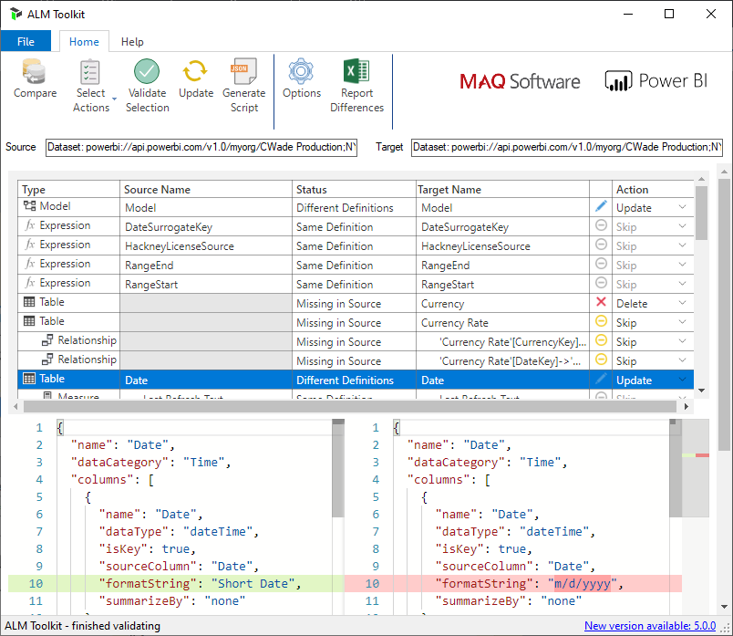

# Corporate BI CI/CD Guide
The aim of this guide is to provide Telstra Purple consultants with an understanding of how Power BI CI/CD works, and how to configure CI/CD for a client.

## Table of Contents
| No | Title | Notes |
|---|---|---|
|01| [Corporate BI CI/CD Overview](#corporate-bi-ci/cd-overview) | - | 
|02| [Configure Corporate BI CI/CD](#configure-corporate-bi-ci/cd) | - |
|03| [Configure pipeline](#configure-pipeline) | - |
|04| [Configure variable group](#configure-variable-group) | - |
|05| [Configure environment](#configure-environment) | - |
|06| [Configure directory](#configure-directory) | - |
|07| [Configure config file](#configure-config-file) | - |

# Corporate BI CI/CD Overview


CI/CD Process:
1. BI Developer creates Power BI content (.pbix) using Power BI Desktop. All content created (.pbix) shall be commited to a Git **Feature Branch**. 
2. When BI Developer wishes to debug or have other BI Developers debug content, the BI Developer will perform a manual publish to the **Development** Workspace.
3. When the BI Developer is satisfied with the changes, the BI Developer shall create a Pull Request to bring changes from their Feature Branch to the Master Branch. In this step, the following sub-tasks will be performed:
  - BI Developer:  
    - BI Developer to provide description of change in the Pull Request description
    - BI Developer to tag Azure DevOps User Stories that the feature pertains to 
    - BI Developer to tag a reviewer 
  - Reviewer: 
    - Download previous and current .pbix files 
    - Open previous and current .pbix files 
    - Use [ALM Toolkit](http://alm-toolkit.com/) to review data model changes between two .pbix files. Example: 
    - 
    - Approve changes / request for changes
4. Once changes are approved, the BI Developer can merge changes from their Feature branch to the Master branch. This will trigger an automated build (YAML Pipeline). 
5. Once the build is complete (YAML Pipeline), the changes will automatically be deployed to the UAT environment. 
6. The BI Developer will have to manually publish changes to the UAT App (currently there is no Power BI REST API for updating Apps)
7. The end-user can perform validation or testing of the changes deployed to the UAT App
8. Once the end-user has validated the change, the BI Developer can return to the YAML Pipeline and select "Approve" so that changes are approved for deployment to Production
9. Changes will be deployed to the Production Power BI Workspace
10. The BI Developer will have to manually publish changes to the Production App (currently there is no Power BI REST API for updating Apps)
11. The changes are now deployed to the Production App. The end user can consume the Power BI content. 

# Configure Corporate BI CI/CD

For Corporate-BI deployment, you will need to use the [powerbi-cicd.yml](../pipelines/powerbi-cicd.yml) deployment pipeline to perform the deployment. 

## Configure variable group
A variable group is used to store variables used in the deployment pipeline. 

To set up the variable group: 
1. Go to your Azure DevOps project
2. Select Pipelines
3. Select Library
4. Create a new variable group called "`powerbi-vg`"
5. Specify the following variables in the variable group: 
    - APPLICATION_ID : application id of the power bi service principal 
    - APPLICATION_KEY (secret) : application key of the power bi service principal 
    - DEPLOY_CHANGES_ONLY : indicator to deploy only changed .pbix files or all .pbix files. Allowed values: `true`, `false`
    - TENANT_ID : tenant id of the Azure tenant
6. Save

## Configure pipeline
A pipeline is used to deploy changes to Power BI Workspaces. 

To set up the pipeline: 
1. Go to your Azure DevOps project
2. Select Pipelines
3. Select New pipeline
4. Select Azure Repos Git (YAML)
5. Select your Repository name
6. Select 'Existing Azure Pipelines YAML file'
7. Select path where the YAML pipeline is stored: `/pipelines/powerbi-cicd.yml`
8. Select Continue and Save

## Configure environment
An environment is used to configure approval gates when deploying to production. We set up an environment for UAT too, however we do not set an approval gate there - it's just there if we need to set up an approval gate for UAT. 

To set up the environment:
1. Go to your Azure DevOps project
2. Select Pipelines
3. Select Environments 
4. Select New environment 
5. Type in: "Power BI UAT" and select Create (Power BI UAT environment completed)
6. Repeat this process and type in "Power BI Production" and select Create
7. For "Power BI Production", Select the environment, select the elipse, and select "Approvals and checks"
8. Select "+" and select "Approvals" 
9. Enter your Azure AD User email or the email to be used for approvals in the demo 
10. Select Create (Power BI Production environment completed)

## Configure directory
```
organization
|-- _Datasets
|-- _Reports
|-- Level1_A
|-- Level1_B
|-- Level1_C
    |-- _Datasets
    |-- _Reports
    |-- Level2_A
    |-- Level2_B
    |-- Level2_C
        |-- _Datasets
        |-- _Reports
        |-- Level3_A
        |-- Level3_B
        |-- Level3_C
            |-- _Datasets
            |   |-- DatasetA
            |       |   DatasetA.pbix
            |       |   config.json
            |   |-- DatasetB
            |       |   DatasetB.pbix
            |       |   config.json
            |-- _Reports
            |   |-- ReportA
            |       |   ReportA.pbix
            |       |   config.json
            |   |-- ReportB
            |       |   ReportB.pbix
            |       |   config.json
```
Configure the repository folder structure as per the diagram above. One `config.json` file will need to be created per .pbix file. Store each .pbix file in a separate folder with a corresponding `config.json` file. The `config.json` file will contain the instructions for the Deployment pipeline on where and how the .pbix should be deployed. 

## Configure config file
The following key-value pairs are currently supported for the `config.json` file. 
| Name | Type | Description | 
|---|---|---|
| environment.environmentObject | JSON | The environment config object. Allowed keys are: `UAT` and `production` |
| environment.environmentObject.workspaceId | String | The Power BI Workspace id | 
| environment.environmentObject.deploy | Boolean | Specifies if .pbix should be pubished to the specified workspace. Allowed values: `true`, `false` | 
| environment.environmentObject.datasetOnly | Boolean | Specifies if only the .pbix dataset should be published. Allowed values: `true`, `false` | 
| environment.environmentObject.rebindReportToDataset | Boolean | Specifies whether the .pbix report should be rebinded to a different dataset. If `true` is specified, then `datasetId` will need to be specified. Allowed values: `true`, `false` | 
| environment.environmentObject.datasetId | (Optional) String | The dataset id for the .pbix. Only required if `rebindReportToDataset` is set to `true` |
|environment.evironmentObject.connectionProperties| (Optional) JSON Array | The connectionProperties object to specify details for updating the data sources of a dataset once deployed. See below for more details |

<br/>

## Connection Properties
The following describes the object schema for a single element of the connectionProperties object within the `config.json` file.
| Name | Type | Description |
|---|---|---|
| connectionProperties.dataSourceName | (Optional) String | The name of the data source to be updated. Only used for to increase readability of config file|
|  environment.evironmentObject.connectionProperties.dataSourceType| String | The type of the data source to be updated* |
| environment.evironmentObject.connectionProperties.oldConnection | JSON | `DatasourceConnectionDetails` object of the data source to be updated (see [Microsoft documentation](https://docs.microsoft.com/en-us/rest/api/power-bi/datasets/updatedatasourcesingroup#datasourceconnectiondetails) for more information) |
| environment.evironmentObject.connectionProperties.newConnection | JSON | `DatasourceConnectionDetails` object of the data source updating to (see [Microsoft documentation](https://docs.microsoft.com/en-us/rest/api/power-bi/datasets/updatedatasourcesingroup#datasourceconnectiondetails) for more information)


*Currently Power BI only supports updating data sources of the following types:
* SQL Server
* Azure SQL Server
* Analysis Services
* Azure Analysis Services
* OData Feed
* SharePoint
* Oracle
* Teradata
* SapHana

Sample `config.json`
```json
{
    "environment": {
        "UAT": {
            "workspaceId": "44506cf6-2c62-4b22-9994-f98f82011f78",
            "deploy": true,
            "datasetOnly": false,
            "rebindReportToDataset": true,
            "datasetId": "69752a43-d254-46e3-9681-201b16dc148d"
        },
        "production": {
            "workspaceId": "6fa4b149-3a99-4902-a02c-9667c0d378dd",
            "deploy": true,
            "datasetOnly": false,
            "rebindReportToDataset": true,
            "datasetId": "2598a3b1-59b9-4974-8331-a3349f33304f"
        }
    }
}
```
Sample `config.json` (for dataset with data source updating enabled)
```json
{
  "environment": {
    "UAT": {
      "workspaceId": "44506cf6-2c62-4b22-9994-f98f82011f78",
      "deploy": true,
      "datasetOnly": true
    },
    "production": {
      "workspaceId": "6fa4b149-3a99-4902-a02c-9667c0d378dd",
      "deploy": true,
      "datasetOnly": true,
      "connectionProperties": [
        {
          "dataSourceName": "DataSourceA",
          "dataSourceType": "Sql",
          "oldConnection": {
            "server": "dev-tlp-ads-bi-sql-002.database.windows.net",
            "database": "wideworldimporters-db"
          },
          "newConnection": {
            "server": "dev-tlp-ads-bi-sql-002.database.windows.net",
            "database": "wideworldimporters-dw"
          }
        }
      ]
    }
  }
}
```