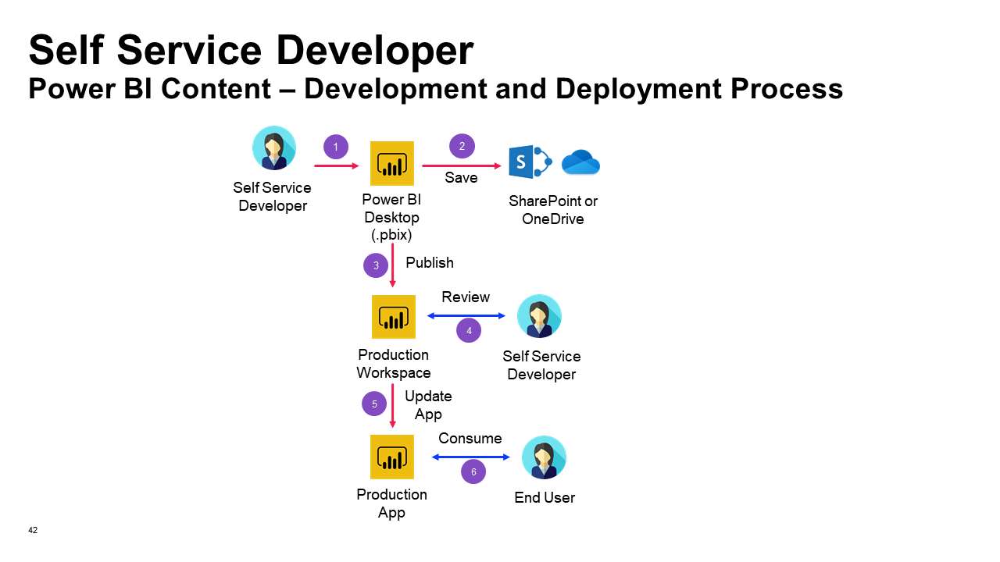

# Self-Service Development and Deployment Guide
The aim of this guide is to provide clients with an understanding of how Self-Service development and deployment works. 

1. The Self Service BI Developer creates Power BI content (.pbix) using Power BI Desktop.
2. All content created (.pbix) should be saved to either a SharePoint document folder or a OneDrive folder. Generally speaking, that shall be the appropriate SharePoint or OneDrive location for the content. For example: 
    - Team specific content -> Team OneDrive
    - Division specific content -> Division OneDrive
3. When the Self Service BI Developer is satisfied with the changes, the Developer shall publish the Power BI content to the Production Workspace. 
4. When the Power BI content is published to the Power BI Workspace, a review is performed by a different member of the Self Service BI Team:
  - BI Developer:  
    - Self Service BI Developer to request another Self Service BI Developer to perform a review of the changes in the Power BI Workspace 
  - Reviewer: 
    - Validates that requirements are met
5. Once changes are approved, the Self Service BI Developer will have to manually publish changes to the Production App.
6. The changes are now deployed to the Production App. The end user can consume the Power BI content. 