# User Guide

[[_TOC_]]

The Web App Configurator User Interface (UI) allows users to interact
with the **ADS_Config** database which contains meta-data required for
downstream processes such as Azure Data Factory scheduled pipelines and
the Databricks delta engine. The sections below discuss features of the
Web App Configurator Web UI, definitions for configurable fields, and
step-by-step instructions on how to change configurations.

## Login

### Authentication

Authentication to the Web UI uses Azure AD Authentication to
authenticate users belonging to the Azure AD Group specified in the `config.DEV|PRD.json` file.

Only users in that Azure AD Group can access the Web UI.
W
To login to the app, refer to steps below:

1. Access the web URL in your browser

2. Provide your email address and password to sign-in

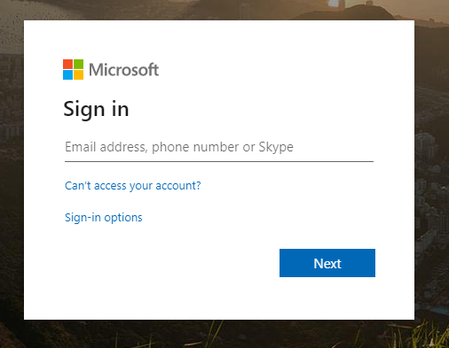

3. Approve the sign-in request with your secondary device (multi-factor
   authentication)

## Systems

Systems represent source system databases that the User wishes to
import.

**Example of systems**:
CompanyX has two source system databases hosted on Oracle Server. To
load both source system databases, the DLA user creates two systems in
DLA System.

### Index

The index page of Systems appears as so:

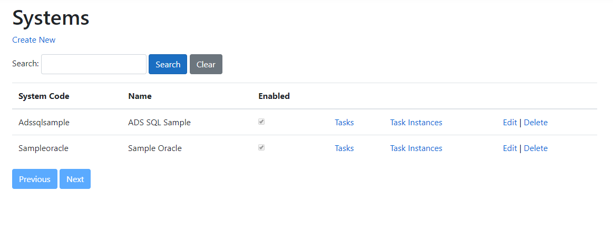

### Create new

To create a new system, refer to the steps below:

1. Select **Create new**

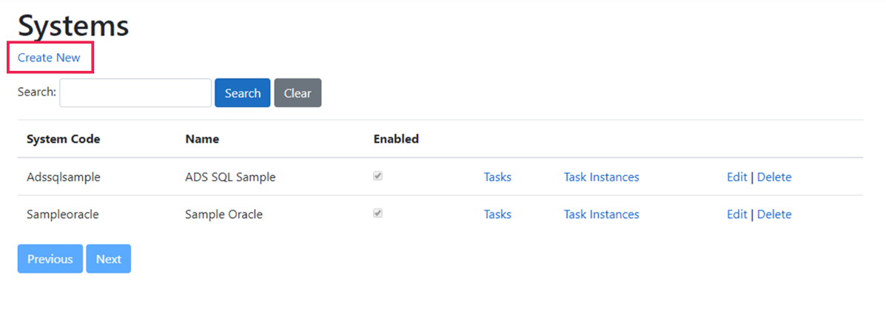

2. Populate System fields

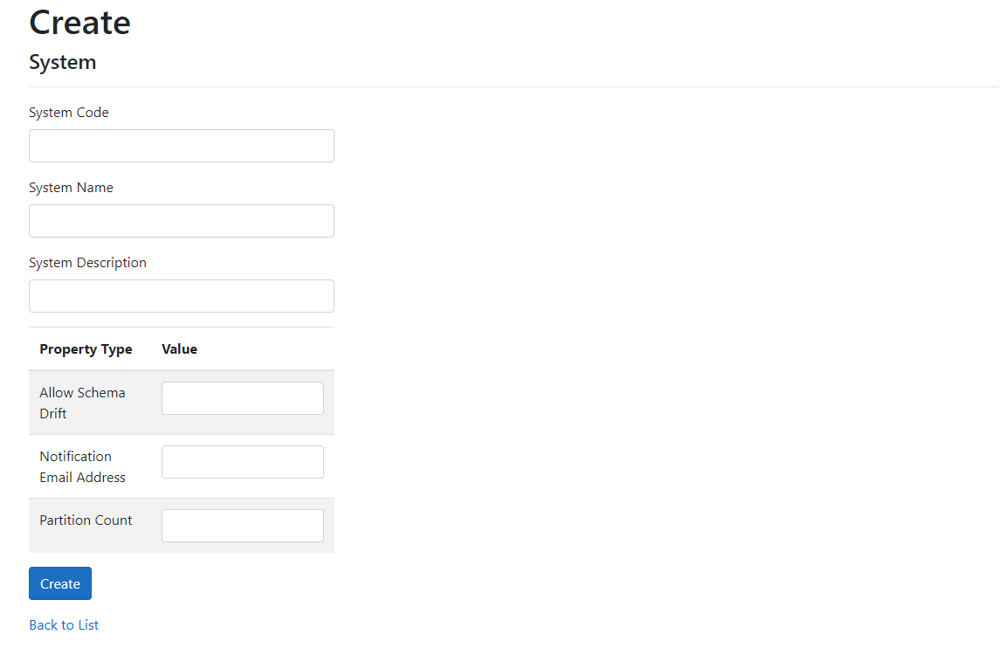

3. Select **Create**

**Field definitions**
| **Field Name** | **Data Type** | **Definition** |
| --- | --- | --- |
| System Code | Text | A code for the system. The system Code is used in two places:   1. Data Lake system folder name. `<StorageContainer>/Raw/<SourceSystem>/<Schema>/<ObjectName>/<YYYY>/<MM>/<DD>/<ObjectName>`.parquet   2. Staging database schema name.   `[<SourceSystemCode>].[<SourceSystemObjectName>]`
| System Name | Text | Name of the system. There cannot be any duplicates for the system name. |
| System Description | Text | Description of the system. |
| Allow Schema Drift | Number | Allows only **1** or **0**. Where 1 = True, and 0 = False. |
| Notification Email Address | Text | Email address where error notifications from the scheduled runs are sent to. |
| Partition Count | Number | The number of partitions to use when doing batch loads for certain tables. The default is 10. |

### Search

The search box allows searches on text fields visible in the systems
table.

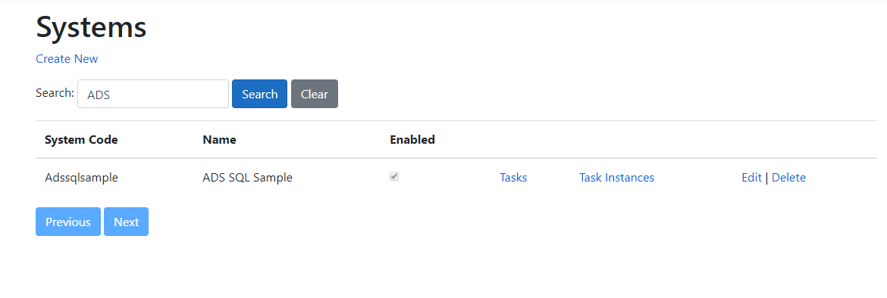

### Edit

To edit a system, refer to the steps below:

1. Select **Edit**

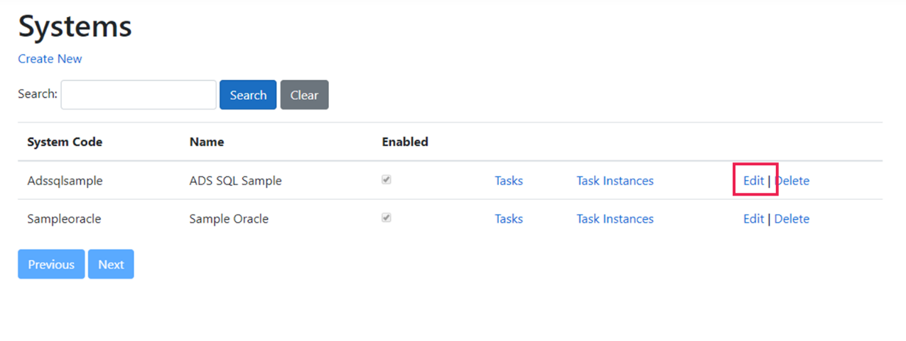 2. Change fields as required

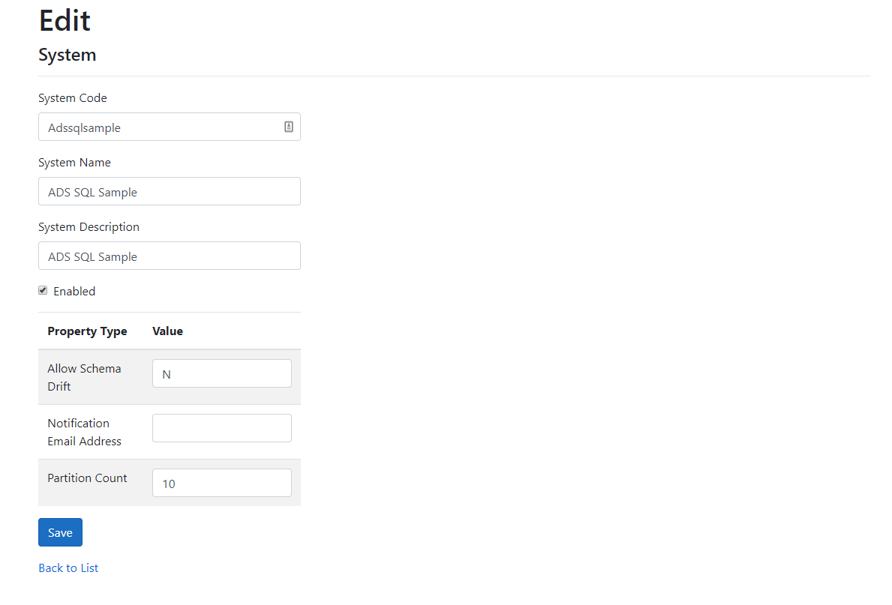

3. Select **Save**

### Delete

To delete a system, refer to the steps below:

1. Select **Delete** for a system you wish to delete

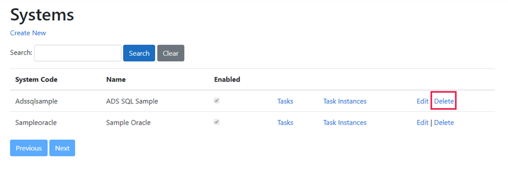

### Systems Tasks

To navigate to tasks, refer to the steps below:

1. Select **Tasks** to view all tasks for the specified system

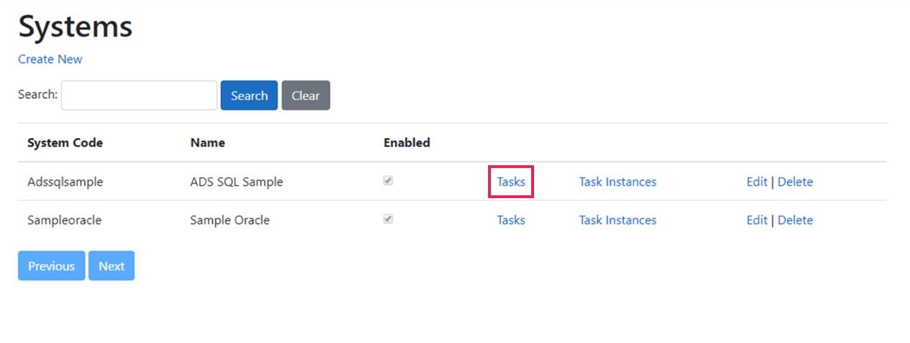

### Systems Task Instances

To navigate to task instances, refer to the steps below:

1. Select **Task Instances** to view all task instances for the
   specified system

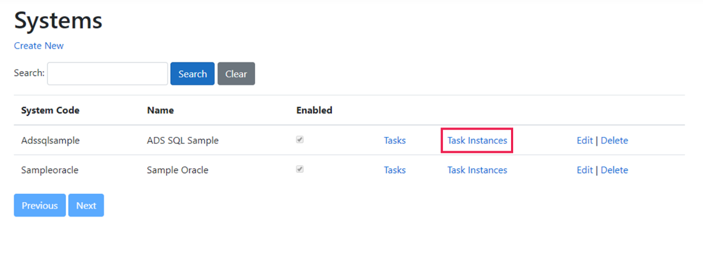

## Tasks

Tasks represent a single table within a source system that the DLA User
wishes to import.

**Example of tasks**:\
CompanyX has a source system database hosted on Oracle Server. Within
the system, there are 10 tables the DLA user wishes to import. To import
the 10 tables, the DLA user creates 10 tasks in DLA Tasks.

### Index

The index page of Tasks appears as so:

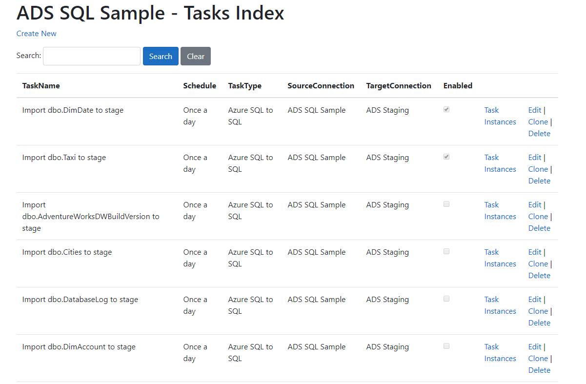

### Create new

To create a new task, refer to the steps below:

1. Select **Create new**

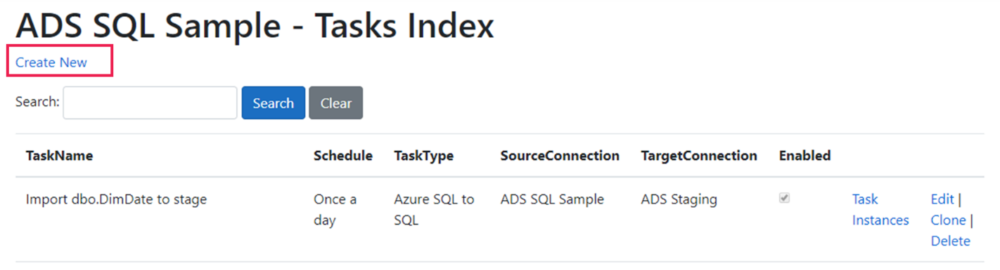

2. Populate Task fields

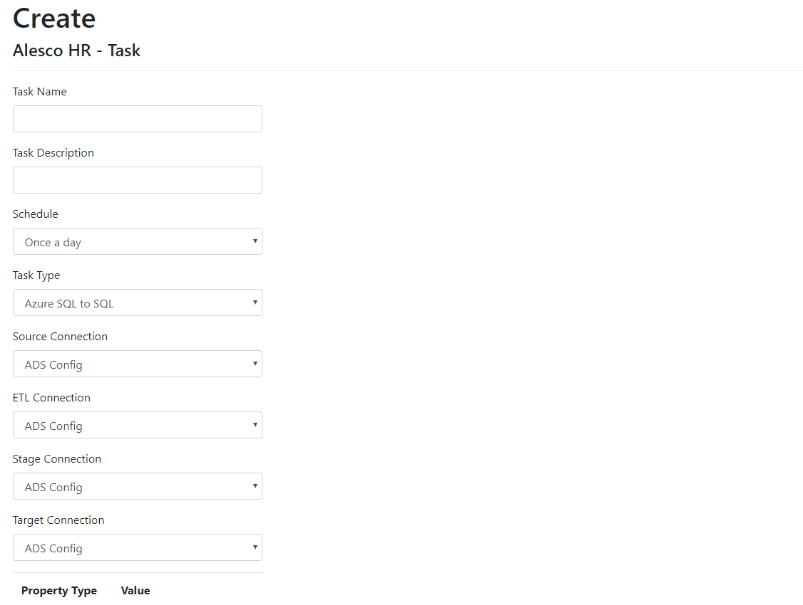

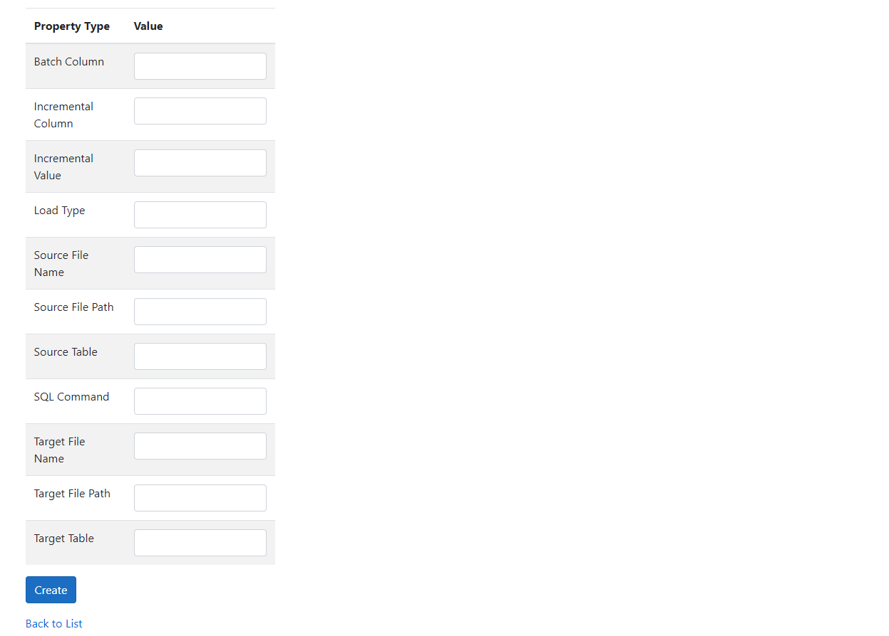

3. Select **Create**

**Field Definitions**

| **Field Name**     | **Data Type** | **Definition**                                                                                                                                                                                                                                                                                                                                                                                                                                                                                                                        |
| ------------------ | ------------- | ------------------------------------------------------------------------------------------------------------------------------------------------------------------------------------------------------------------------------------------------------------------------------------------------------------------------------------------------------------------------------------------------------------------------------------------------------------------------------------------------------------------------------------- |
| Task Name          | Text          | Name of the task.                                                                                                                                                                                                                                                                                                                                                                                                                                                                                                                     |
| Task Description   | Text          | Description of the task.                                                                                                                                                                                                                                                                                                                                                                                                                                                                                                              |
| Schedule           | List          | List of schedules for the task.                                                                                                                                                                                                                                                                                                                                                                                                                                                                                                       |
| Task Type          | List          | List of task types for the task.                                                                                                                                                                                                                                                                                                                                                                                                                                                                                                      |
| Source Connection  | List          | List of source connections for the task. This determines what source connection to use.                                                                                                                                                                                                                                                                                                                                                                                                                                               |
| ETL Connection     | List          | List of ETL connections for the task. This determines what ETL connection to use. Select Databricks ETL Cluster which is used primarily as it is used as the delta engine and for ingestion into SQL.                                                                                                                                                                                                                                                                                                                                 |
| Stage Connection   | List          | List of staging connections for the task. This determines where to write staging data.                                                                                                                                                                                                                                                                                                                                                                                                                                                |
| Target Connection  | List          | List of target connections for the task. This determines where to write target data.                                                                                                                                                                                                                                                                                                                                                                                                                                                  |
| Batch Column       | Text          | This is the column in the source entity which is to be used to perform batch loads from source. Batch loads are typically used where the number of records in a source system entity is more than 40-50 million. The batch size is dynamically calculated based on the **Partition Count** system property. If the batch column is of type **Date** , batches will be according to the range of years prevalent in the data. If the data type is **Numeric** , equal size batches will be generated based on the **Partition Count**. |
| Incremental Column | Text          | This is the column in the source entity which is to be used for incremental loads. Incremental loads are typically done if source system data is only additive in nature i.e. no data is ever deleted.                                                                                                                                                                                                                                                                                                                                |
| Incremental Value  | Number        | This is the number of values to go back for when doing incremental loads. If the data type of the incremental column is date, this will be days. If the source data type is numeric, this will be a numeric value based on the latest value in the source entity.                                                                                                                                                                                                                                                                     |
| Load Type          | Text          | The available options for this field are: &quot;Incremental&quot;, &quot;Full&quot;. Must be set to incremental if the **Incremental Column** and **Incremental Value** are specified. The default is **Full** which means all the data will be loaded from the source entity on a scheduled basis.                                                                                                                                                                                                                                   |
| Source File Name   | Text          | This is not relevant at the time of writing                                                                                                                                                                                                                                                                                                                                                                                                                                                                                           |
| Source Table       | Text          | The name of the source entity. This can be blank if the **SQL Command** value is provided                                                                                                                                                                                                                                                                                                                                                                                                                                             |
| SQL Command        | Text          | The custom SQL command to execute against the source system                                                                                                                                                                                                                                                                                                                                                                                                                                                                           |
| Target File Name   | Text          | The parquet file name for the data lake. The general format is <Entity Name>.parquet                                                                                                                                                                                                                                                                                                                                                                                                                                                  |
| Target File Path   | Text          | The file path in the data lake where the **Target File Name** will be stored. Format is: `<StorageContainer>/Raw/<SourceSystem>/<Schema>/<ObjectName>`                                                                                                                                                                                                                                                                                                                                                                                |
| Target Table       | Text          | The target table in the **ADS_Stage** database where the source entity will reside. The format is: `[<System Code>].[<Source Entity Name>] `                                                                                                                                                                                                                                                                                                                                                                                          |

### Search

The search box allows searches on text fields visible in the tasks
table.

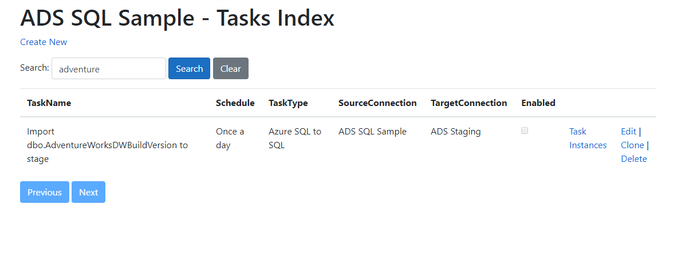

### Edit

To edit a task, refer to the steps below:

1. Select **Edit**

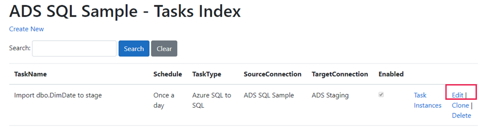

2. Change fields as required

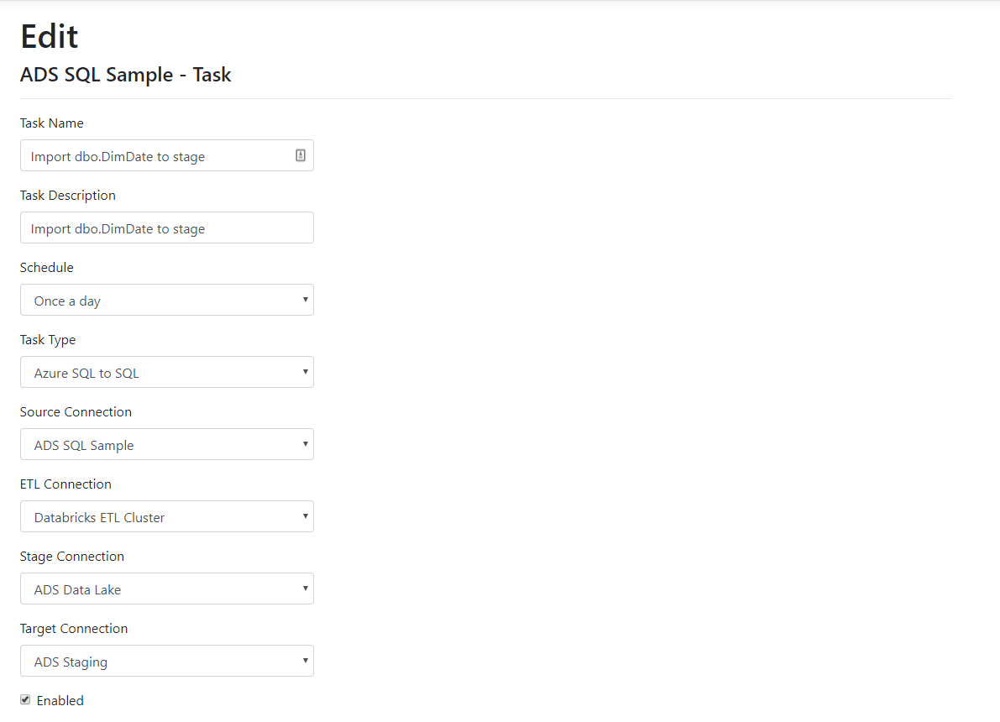

3. Select **Save**

### Clone

To clone an existing task, refer to the steps below:

1. Select **Clone**

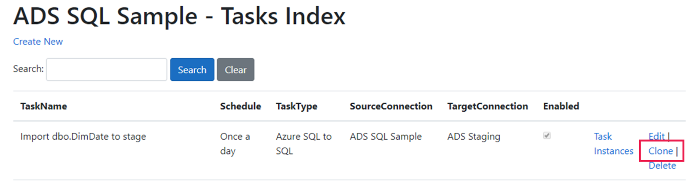

2. Change fields as required

3. Select **Save**

### Delete

To delete a task, refer to the steps below:

1. Select **Delete** for a task you wish to delete

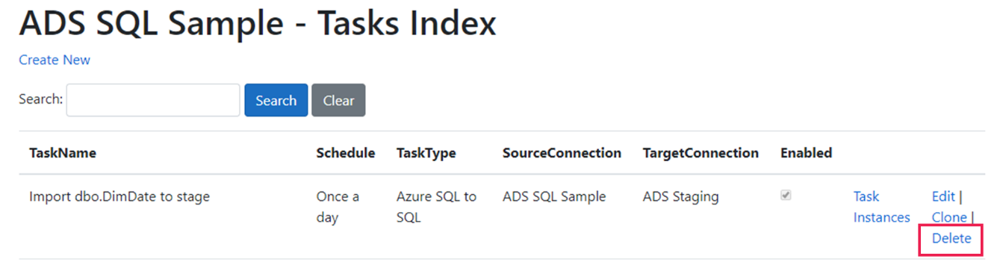

### Tasks Task Instances

To navigate to task instances, refer to the steps below:

1. Select **Task Instances** to view all task instances for the
   specified task

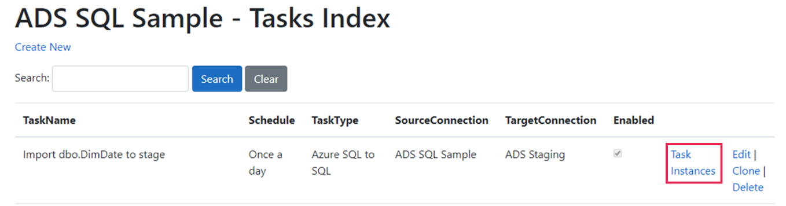

## Task Instances

Tasks Instances are all the individual runs of a task. A new task
instance is created for each scheduled window a task is required to run.
For example, a schedule window exists for TaskX for Once a Day. At the
set time each day, a new task instance is created with a status of
"Untried".

A task instance can contain multiple runs. For example, a task instance
could contain a single run which failed, and the same task instance
could contain a single run which was successful. Both runs belong to the
same task instance. After the run is complete, the task instance's
status will update to "Success" or "Failure -- Retry" depending on
success or failure.

### Index

The index page of Task Instances appears as so:

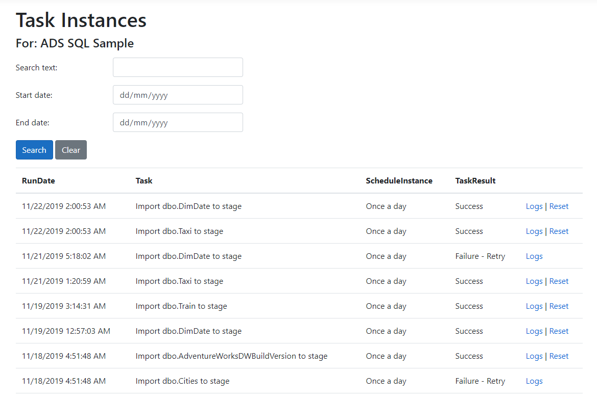

### Search

The search box allows searches on text fields visible in the task
instances table, or a date range for run dates.

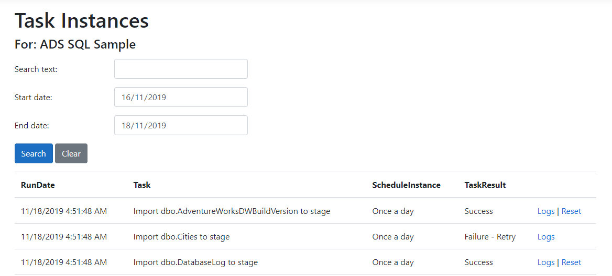

### Logs

To navigate to a task instance's logs, refer to the steps below:

1. Select **Logs** for a task instance

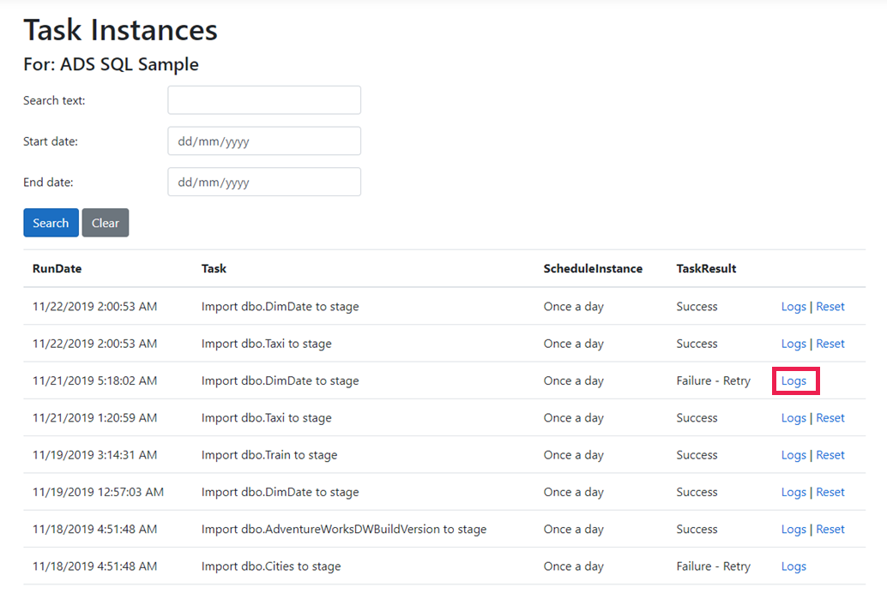

2. Review logs of the run for the task instance

### Reset

If the DLA User wishes to re-run a task instance even though the run had
succeeded in the past, then the User can reset a task instance. To reset
a task instance, refer to the steps below:

1. Select **Reset** for a task instance

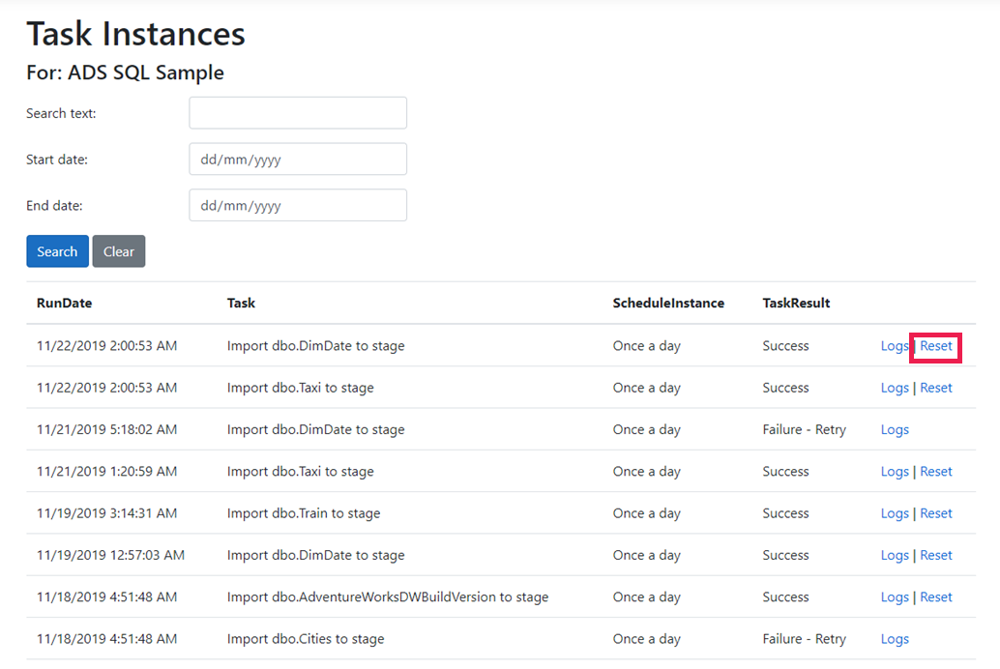

## Maintenance Data

To configure Settings, Connections and Schedules, refer to the steps
below:

1. Select Maintenance Data

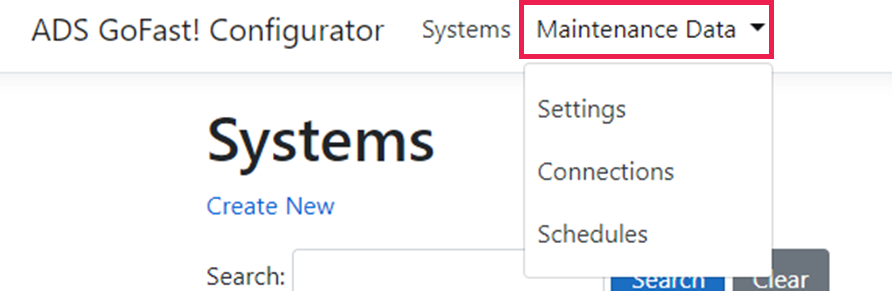

2. Select the section you would like to configure

## Settings

To change general settings in the DLA **ADS_Config** database, refer to
the steps below:

1. Select **Maintenance Data**

2. Select **Settings**

3. Change settings as required. **Do not** change the URL's for the
   Logic Apps as they will cease to work if altered in any way.

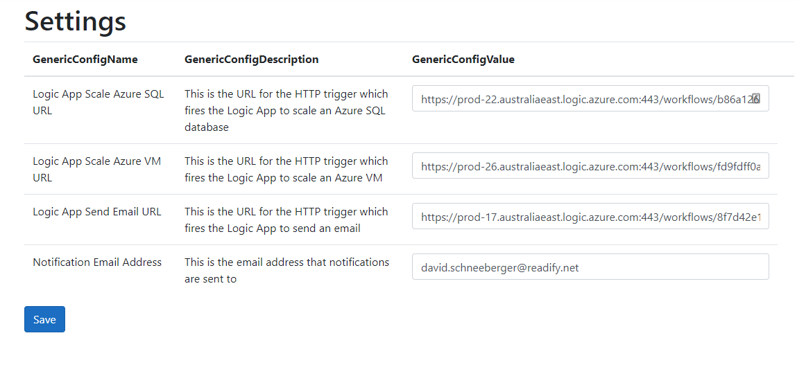

4. Select **Save**

## Connections

Connections are required for DLA to connect to the **Source** storage,
**ETL** process engine, **Staging** storage, and **Target** storage. All
connection strings are stored in Azure Key Vault for security reasons,
and the names of the secrets provided to DLA.

### Index

The index page of Connections appears as so:

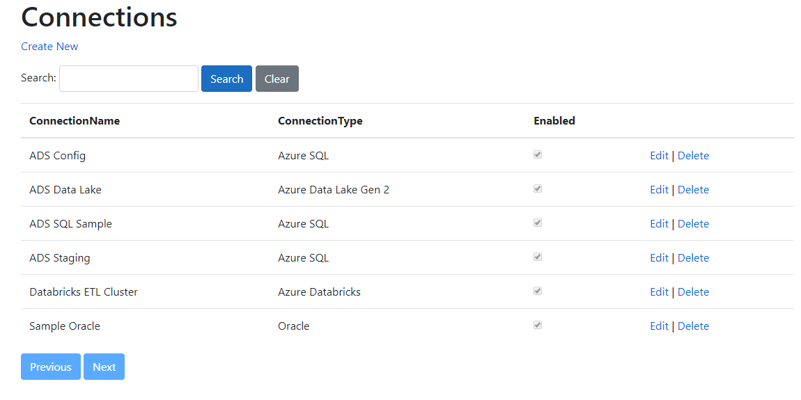

### Create new

To create a new connection, refer to the steps below:

1. Select **Create new**

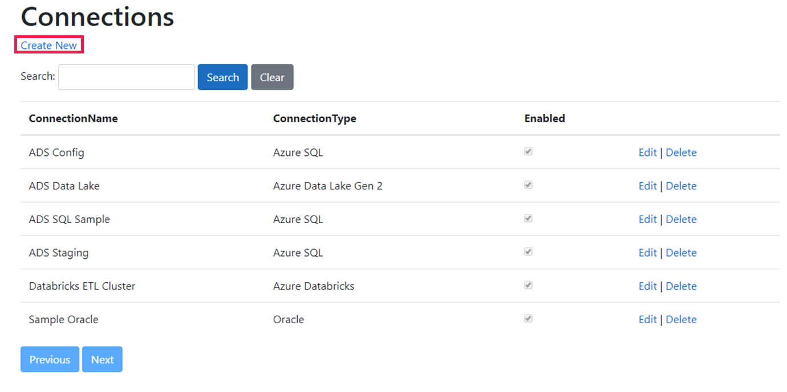

2. Change fields as required

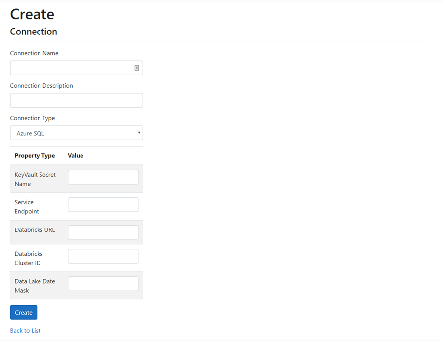

3. Select **Create**

**Field Definitions**

| **Field Name**         | **Data Type** | **Definition**                                                                                                            |
| ---------------------- | ------------- | ------------------------------------------------------------------------------------------------------------------------- |
| Connection Name        | Text          | Name of the connection.                                                                                                   |
| Connection Description | Text          | Description of the connection.                                                                                            |
| Connection Type        | List          | List of connection types for the connection.                                                                              |
| KeyVault Secret Name   | Text          | The secret name for the Key Vault Secret containing the connection string.                                                |
| Service Endpoint       | Text          | This the service endpoint for the Azure Data Lake Gen 2 storage account                                                   |
| Databricks URL         | Text          | URL for the Databricks Workspace containing the delta engine notebooks.                                                   |
| Databricks Cluster ID  | Text          | The cluster ID for the Databricks Cluster used for the delta engine and ingestion to SQL.                                 |
| Data Lake Date Mask    | Text          | This is used to determine the target folder structure in the Raw area of the data lake. The default format is: YYYY/MM/DD |

### Edit

To edit connections, refer to the steps below:

1. Select **Edit**

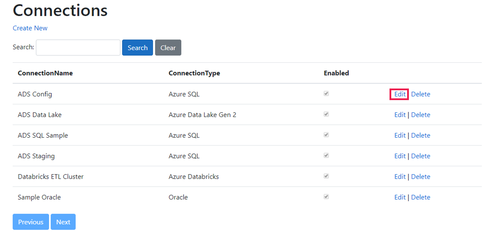

2. Change fields as required

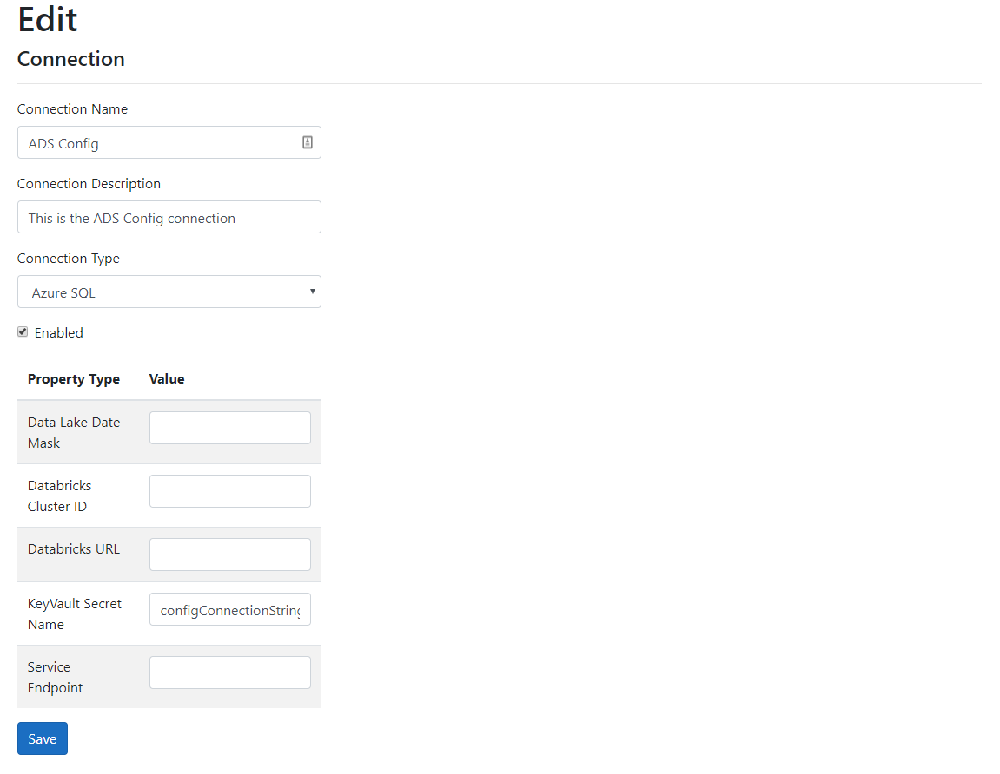

3. Select **Save**

### Delete

To delete a connection, refer to the steps below:

1. Select **Delete** for a connection

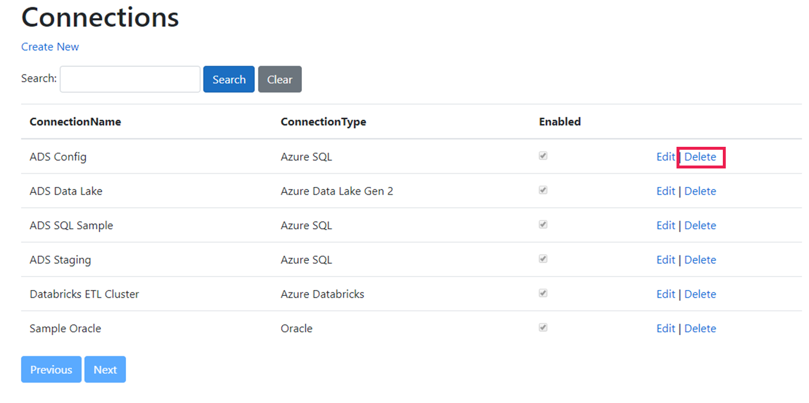

## Schedules

Schedules are used to specify the time interval for task loads. Created
tasks will run against a specified schedule.

**Schedule example**:\
CompanyX has 100 tasks to run daily, and 50 tasks to run every hour. The
DLA User creates 100 tasks and specifies the schedule to "Once a day",
and then creates 50 tasks and specifies the schedule to "Once every
hour".

### Index

The index for the schedule page appears as so:

### Create new

To create a new schedule, refer to the steps below:

1. Select **Create new**

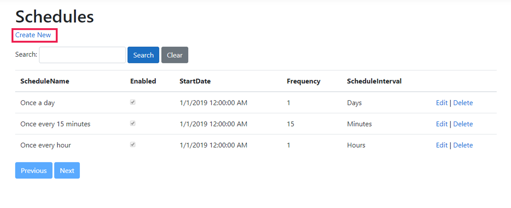 2. Change the fields as required

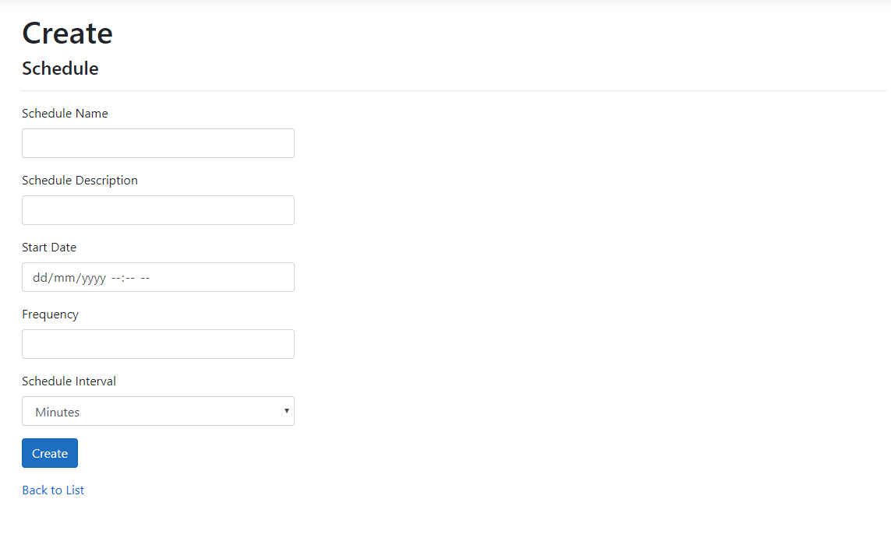

3. Select **Create**

**Field Definitions**

| **Field Name**       | **Data Type** | **Definition**                                                                                                                                                                                                                                    |
| -------------------- | ------------- | ------------------------------------------------------------------------------------------------------------------------------------------------------------------------------------------------------------------------------------------------- |
| Schedule Name        | Text          | Name of the schedule.                                                                                                                                                                                                                             |
| Schedule Description | Text          | Description of the schedule.                                                                                                                                                                                                                      |
| Start Date           | Date          | Date and Time for the connection start date. The frequency and interval will increment against the start date. E.g. If start date is 01/01/2019 00:00 and frequency is specified to 15 minutes, then the next run will occur at 01/01/2019 00:15. |
| Frequency            | Number        | The frequency of the schedule based on the schedule interval units chosen.                                                                                                                                                                        |
| Schedule Interval    | List          | The units for the schedule interval. Available list options are: Minutes, Hours, Days.                                                                                                                                                            |

### Edit

To edit a schedule, refer to the steps below:

1. Select **Edit**

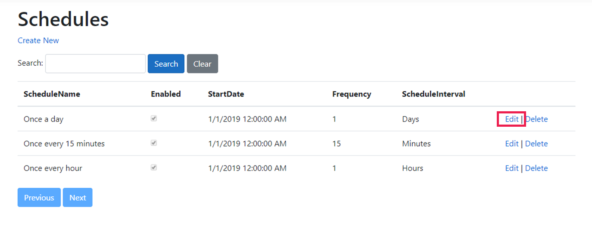

2. Change the fields as required

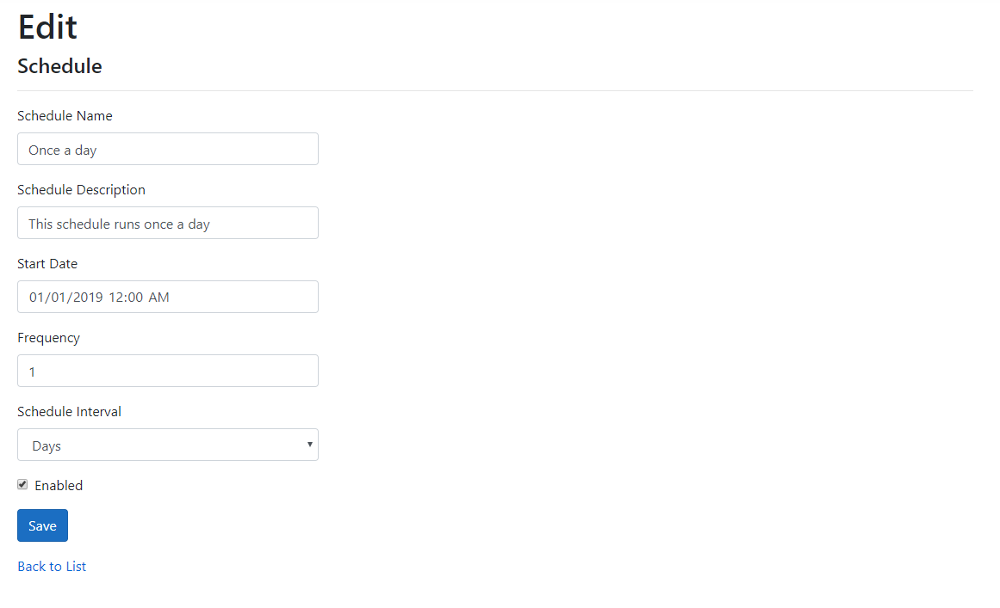

3. Select **Save**

### Delete

To delete a schedule, refer to the steps below:

1. Select **Delete** for a schedule you wish to delete

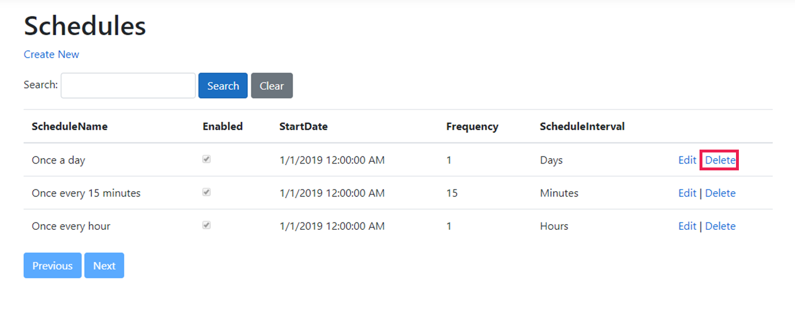
